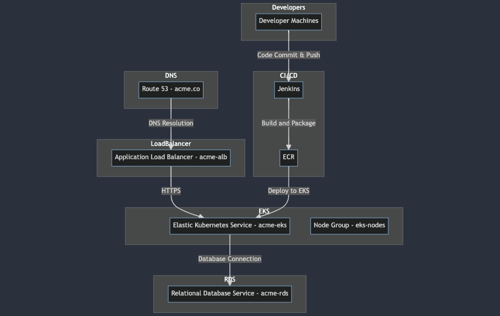
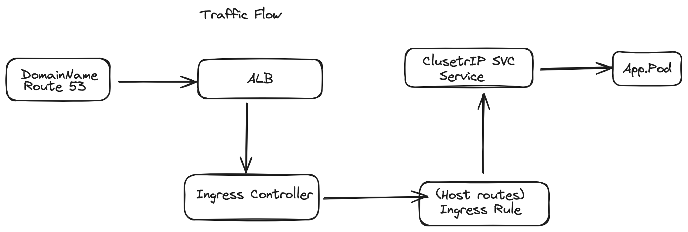

# Task 1: Infrastructure

## Design Proposal

The proposed infrastructure design leverages various AWS resources to create a secure and scalable environment for ACME's application.

### AWS Resources

**1. Application Load Balancer (ALB):**
   - **Purpose:** Serves as a central entry point for user traffic, ensuring even distribution to multiple instances within the Elastic Kubernetes Service (EKS) cluster.
   - **Key Considerations:**
     - ALB provides layer 7 routing, enabling path-based routing for microservices.
     - Supports HTTPS for secure communication with users.
     - Can be configured to handle WebSocket traffic.

**2. Elastic Kubernetes Service (EKS Cluster):**
   - **Purpose:** Hosts microservices within containers, facilitating efficient management, scaling, and deployment.
   - **Key Considerations:**
     - EKS abstracts the complexity of Kubernetes, providing a managed service.
     - Supports multiple Availability Zones for high availability.
     - Ensures compatibility with Kubernetes tooling.

**3. Relational Database Service (RDS):**
   - **Purpose:** Hosts the database for ACME's application, ensuring scalable, secure, and highly available data operations.
   - **Key Considerations:**
     - RDS supports various database engines, including MySQL and PostgreSQL.
     - Provides automated backups and maintenance.
     - Enables encryption at rest for data security.

**4. Elastic Container Registry (ECR):**
   - **Purpose:** Manages Docker container images used for deploying containerized applications within the EKS cluster.
   - **Key Considerations:**
     - Integrates seamlessly with EKS for image deployments.
     - Provides secure storage for Docker images.
     - Supports fine-grained access control.

**5. Route 53 (DNS service):**
   - **Purpose:** Manages domain registration and DNS resolution, directing user traffic to the ALB.
   - **Key Considerations:**
     - Supports both public and private DNS.
     - Enables easy configuration of subdomains for microservices.
     - Provides a reliable and scalable DNS service.

### Non-Application Workload

**1. CI/CD Pipeline:**
   - **Purpose:** Automates the building, testing, and deployment of applications, ensuring a consistent and reliable software development lifecycle.
   - **Key Considerations:**
     - Jenkins, for example, can be used for its extensibility and integration capabilities.
     - Automated builds on code commits trigger the pipeline.
     - Integration with version control systems for seamless workflow.

**2. Monitoring:**
   - **Purpose:** Utilizes AWS CloudWatch and CloudTrail for monitoring infrastructure performance and security.
   - **Key Considerations:**
     - CloudWatch provides metrics, logs, and alarms for proactive monitoring.
     - CloudTrail records API calls, ensuring traceability and security auditing.
     - Allows for setting up custom alerts for critical events.

**3. Backups:**
   - **Purpose:** Regularly backs up critical data, especially the RDS database, to ensure data integrity and recovery options.
   - **Key Considerations:**
     - Automated backup solutions provided by AWS RDS.
     - Regularly scheduled backups to Amazon S3 for durability.
     - Enables point-in-time recovery for RDS instances.

### User Traffic Flow

**1. User Traffic Flow:**
   - **Flow Description:**
     - User traffic is directed through Route 53 to the ALB.
     - ALB efficiently distributes traffic to instances within the EKS cluster.
   - **Key Considerations:**
     - ALB automatically scales with incoming traffic.
     - Supports routing based on URL paths or hostnames.
     - Enables SSL termination for secure communication.

### Security Measures
**1. IAM Roles (Identity and Access Management):**
   - **Purpose:** Enforces fine-grained access control for AWS resources.
   - **Key Considerations:**
     - IAM roles define what actions users, groups, and services are allowed to perform.
     - Least privilege principles ensure minimal necessary permissions.
     - IAM roles for EC2 instances and Kubernetes service accounts.

**2. Encryption:**
   - **Purpose:** Implements encryption mechanisms for data at rest and in transit.
   - **Key Considerations:**
     - Encryption at rest for RDS databases ensures data security.
     - Encryption in transit for communication between microservices.
     - Utilizes AWS Key Management Service (KMS) for key management.

**3. Network Policies:**
   - **Purpose:** Defines policies for communication between microservices within the EKS cluster.
   - **Key Considerations:**
     - Kubernetes Network Policies control traffic between pods.
     - Policies are defined based on pod selectors and namespaces.
     - Ensures secure and controlled communication between microservices.

**4. Regular Updates:**
   - **Purpose:** Establishes a routine for applying security patches and updates to all components.
   - **Key Considerations:**
     - Regularly monitors for security advisories and updates.
     - Utilizes automation for updating EKS worker nodes, ALB, and other components.
     - Ensures compliance with security best practices.

### Migration Strategy
**1. Old Infrastructure:**
   - **Description:** Represents the existing infrastructure hosting the application.
   - **Considerations:**
     - Requires a phased migration approach to minimize downtime.
     - Continued operation during the migration process.

**2. Parallel Environment (New EKS Cluster):**
   - **Description:** Establishes a new EKS cluster in parallel with the old infrastructure.
   - **Considerations:**
     - Allows for the gradual migration of microservices.
     - Enables testing and validation of the new environment.

**3. New Infrastructure (New EKS Cluster):**
   - **Description:** Represents the target state of the infrastructure.
   - **Considerations:**
     - Microservices are migrated gradually, ensuring a smooth transition.
     - DNS changes route traffic seamlessly to the new environment.

   - Monitor and validate performance before decommissioning the old infrastructure.

*Pleaase Note: The diagram provides a high-level overview of the proposed infrastructure. Detailed configurations and settings are not represented.*
