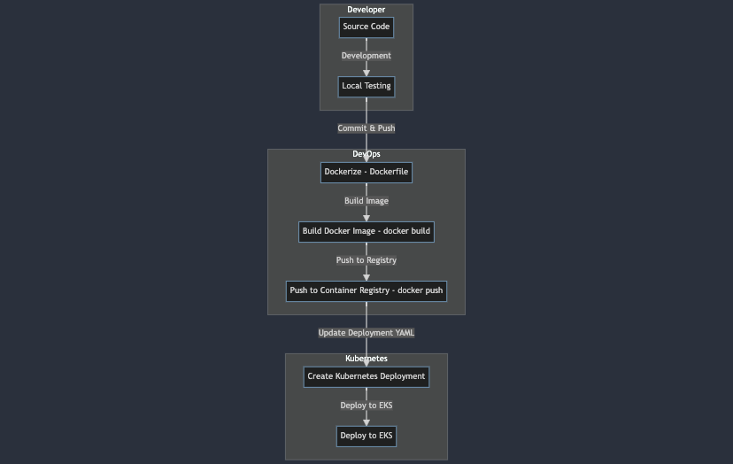

# Task 2: Containerized Deployment
## Design Proposal

The diagram represents the steps involved in containerizing and deploying the Greet application.

### Dockerfile
**1. Purpose:**
   - Creates a Docker image for the Greet application, ensuring consistency across different environments.

**2. Key Considerations:**
   - Installs necessary dependencies using a multi-stage build.
   - Configures the application to run on port 8080.
   - Optimizes the image for size and security.

### Kubernetes Deployment

**1. Purpose:**
   - Defines the desired state for the Greet application within the Kubernetes cluster.

**2. Key Considerations:**
   - Specifies the container image, resources, and environment variables.
   - Configures liveness and readiness probes for health checks.
   - Ensures rolling updates for seamless deployments.

*Please Note: The diagram provides a visual representation of the workflow for containerization, Kubernetes deployment, documentation, and code organization.*
